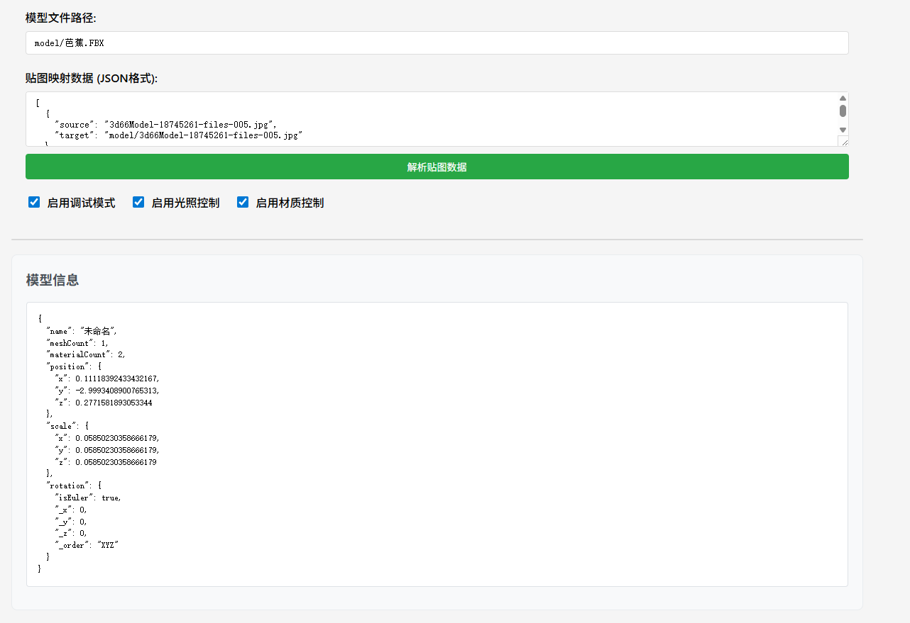

# Vue TresJS 3D模型查看器

[](https://badge.fury.io/js/vue-tres-model-viewer)
[](https://opensource.org/licenses/MIT)
[](https://vuejs.org/)
[](https://www.typescriptlang.org/)

Vue 3 3D模型查看器组件，基于 TresJS 和 Three.js 构建。支持 FBX 格式，提供贴图映射、材质控制和光照调节功能。


## 📸 效果预览

### 基础用法界面


### 3D模型预览效果


### 对等依赖

确保已安装所需的对等依赖：

```bash
npm install vue@^3.3.0 @tresjs/core@^4.0.0 @tresjs/cientos@^4.0.0 three@^0.160.0
```

## 🚀 快速开始

### 全局注册

```typescript
import { createApp } from 'vue'
import ModelViewer from 'vue-tres-model-viewer'
import App from './App.vue'

const app = createApp(App)
app.use(ModelViewer)
app.mount('#app')
```

### 局部注册

```vue
<template>
  <ModelViewer
    :model-url="modelUrl"
    :texture-mapping="textureMapping"
    :width="800"
    :height="600"
    :enable-debug-mode="true"
    @loaded="onModelLoaded"
    @error="onModelError"
  />
</template>

<script setup lang="ts">
import { ref } from 'vue'
import { ModelViewer } from 'vue-tres-model-viewer'
import type { TextureMapping } from 'vue-tres-model-viewer'

const modelUrl = ref('/models/example.fbx')
const textureMapping = ref<TextureMapping[]>([
  { source: 'leaf_texture.jpg', target: '/textures/leaf_diffuse.jpg' },
  { source: 'bark_texture.jpg', target: '/textures/bark_diffuse.jpg' }
])

const onModelLoaded = (model: THREE.Object3D) => {
  console.log('模型加载完成:', model)
}

const onModelError = (error: string) => {
  console.error('模型加载错误:', error)
}
</script>
```

## 📖 API 参考

### 属性 (Props)

| 属性 | 类型 | 默认值 | 描述 |
|------|------|---------|-------------|
| `modelUrl` | `string` | - | 3D模型文件的URL |
| `width` | `string \| number` | `'100%'` | 查看器宽度 |
| `height` | `string \| number` | `'400px'` | 查看器高度 |
| `backgroundColor` | `string` | `'#f0f0f0'` | 背景颜色 |
| `showControls` | `boolean` | `true` | 显示控制面板 |
| `autoRotate` | `boolean` | `true` | 启用自动旋转 |
| `enableShadows` | `boolean` | `true` | 启用阴影 |
| `enableLightingControl` | `boolean` | `false` | 显示光照控制 |
| `enableMaterialControl` | `boolean` | `false` | 显示材质控制 |
| `enableDebugMode` | `boolean` | `false` | 显示调试控制 |
| `textureMapping` | `TextureMapping[]` | `[]` | 贴图映射配置 |
| `cameraConfig` | `CameraConfig` | - | 相机配置 |
| `lightingConfig` | `LightingConfig` | - | 光照配置 |
| `controlsConfig` | `ControlsConfig` | - | 控制器配置 |
| `textConfig` | `TextConfig` | - | 文本标签配置 |
| `modelScale` | `number` | `3` | 模型缩放倍数 |
| `autoFitModel` | `boolean` | `true` | 自动适配模型到视图 |
| `enableCache` | `boolean` | `true` | 启用贴图缓存 |
| `maxTextureSize` | `number` | `2048` | 最大贴图尺寸 |
| `messageHandler` | `MessageHandler` | - | 自定义消息处理器 |

### 事件 (Events)

| 事件 | 参数 | 描述 |
|-------|---------|-------------|
| `loaded` | `THREE.Object3D` | 模型加载完成时触发 |
| `error` | `string` | 加载失败时触发 |
| `progress` | `number` | 加载进度 (0-100) |
| `camera-change` | `[number, number, number]` | 相机位置改变 |
| `material-change` | `string` | 材质模式改变 |
| `lighting-change` | `string` | 光照模式改变 |

### 插槽 (Slots)

| 插槽 | 属性 | 描述 |
|------|-------|-------------|
| `custom-controls` | `{ model, loading, error }` | 自定义控制按钮 |
| `overlay` | `{ model, loading, error }` | 自定义覆盖内容 |

## 🎨 高级用法

### 贴图映射

组件支持复杂模型的贴图映射：

```typescript
const textureMapping: TextureMapping[] = [
  // 漫反射贴图
  { source: 'leaf_diffuse.jpg', target: '/textures/leaves/diffuse.jpg' },
  { source: 'bark_diffuse.jpg', target: '/textures/bark/diffuse.jpg' },
  
  // 法线贴图
  { source: 'leaf_normal.jpg', target: '/textures/leaves/normal.jpg' },
  { source: 'bark_normal.jpg', target: '/textures/bark/normal.jpg' },
  
  // 透明度贴图
  { source: 'leaf_opacity.jpg', target: '/textures/leaves/opacity.jpg' },
  
  // 粗糙度贴图
  { source: 'bark_roughness.jpg', target: '/textures/bark/roughness.jpg' }
]
```

### 自定义光照

```typescript
const lightingConfig: LightingConfig = {
  ambientColor: 0xffffff,
  skyColor: 0x87CEEB,
  groundColor: 0x8B4513,
  mainLightColor: 0xffffff,
  fillLightColor: 0xffffff,
  hemispherePosition: [0, 20, 0],
  mainLightPosition: [10, 10, 5],
  fillLightPosition: [-5, 5, -5]
}
```

### 自定义相机

```typescript
const cameraConfig: CameraConfig = {
  fov: 60,
  near: 0.1,
  far: 2000,
  position: [0, 5, 10]
}
```

### 国际化配置

```typescript
const textConfig: TextConfig = {
  loading: '正在加载模型...',
  errorSubTitle: '请检查模型文件是否正确',
  retry: '重新加载',
  resetCamera: '重置相机',
  wireframe: '线框模式',
  autoRotate: '自动旋转',
  lighting: '光照',
  material: '材质',
  wireframeModes: {
    solid: '实体',
    wireframe: '线框'
  },
  autoRotateTexts: {
    start: '开始旋转',
    stop: '停止旋转'
  },
  lightingModes: {
    bright: '明亮模式',
    normal: '标准模式',
    soft: '柔和模式'
  },
  materialModes: {
    double: '双面材质',
    front: '正面材质',
    basic: '基础材质'
  },
  debugTexts: {
    info: '调试信息',
    reapplyTextures: '重新应用贴图',
    fixLeafMaterials: '修复树叶材质',
    disableTransparency: '禁用透明度'
  }
}
```

### 自定义消息处理器

```typescript
import { ElMessage } from 'element-plus'

const messageHandler = {
  success: (msg: string) => ElMessage.success(msg),
  warning: (msg: string) => ElMessage.warning(msg),
  info: (msg: string) => ElMessage.info(msg),
  error: (msg: string) => ElMessage.error(msg)
}
```

## 🎯 支持的格式

- **GLTF/GLB**: 支持 PBR 材质
- **FBX**: 贴图通道检测
- **OBJ**: 几何体支持

## 🔧 开发

```bash
# 克隆仓库
git clone https://github.com/nuominmin/vue-tres-model-viewer.git
cd vue-tres-model-viewer

# 安装依赖
npm install

# 启动开发服务器
npm run dev

# 构建生产版本
npm run build

# 类型检查
npm run type-check

# 代码检查
npm run lint
```

## 📄 许可证

本项目基于 MIT 许可证 - 查看 [LICENSE](LICENSE) 文件了解详情。

## 🙏 致谢

- [TresJS](https://tresjs.org/) - Vue 3 Three.js 集成
- [Three.js](https://threejs.org/) - 3D 图形库
- [Vue 3](https://vuejs.org/) - 渐进式 JavaScript 框架

## 📞 支持

如果您有任何问题或需要帮助，请：

1. 查看 [文档](https://github.com/nuominmin/vue-tres-model-viewer#readme)
2. 搜索 [现有问题](https://github.com/nuominmin/vue-tres-model-viewer/issues)
3. 创建 [新问题](https://github.com/nuominmin/vue-tres-model-viewer/issues/new)
